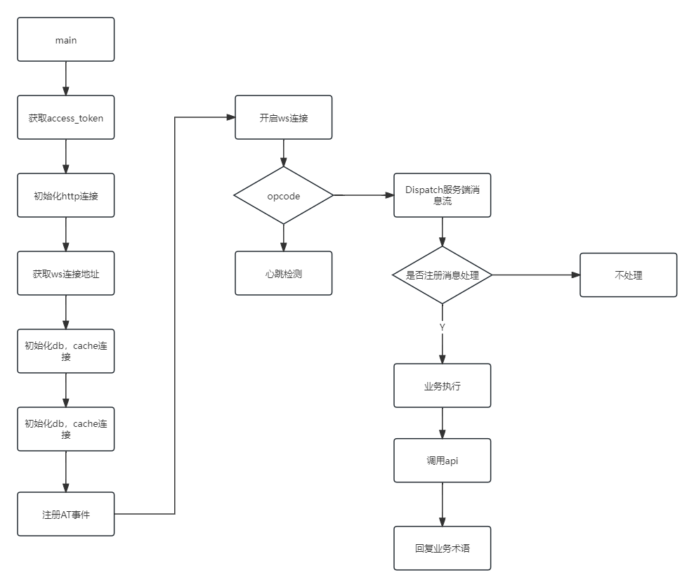
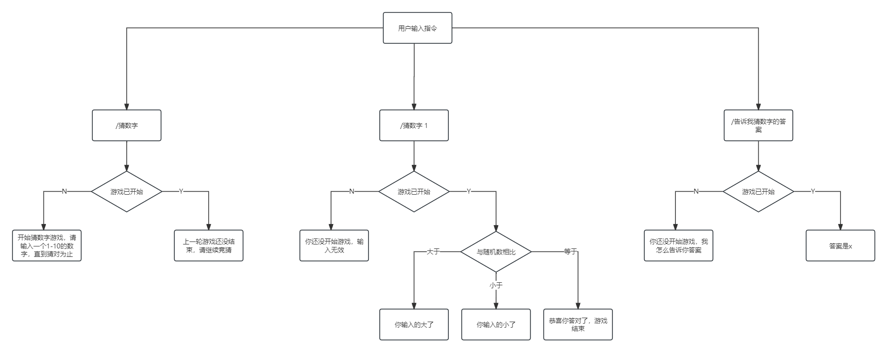
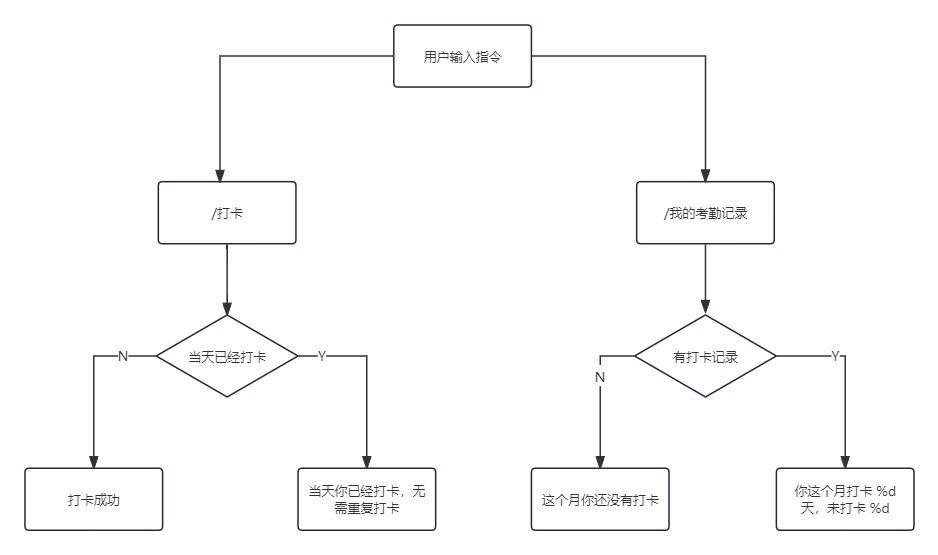

# FishBot
[toc]

### 功能介绍
<ol>
<li>猜数字：输入1-10之间的数字，猜中结束游戏，大于或者小于目标值会返回提示</li>
<li>考勤：用户可进行打卡操作，并且查询当月的打卡统计</li>
</ol>

### 使用技术

Go（1.23.0）、Mysql（8.0.39）、Redis（5.0.7）、go-resty（v2）

### 服务端通信处理流程


### 猜数字功能详细业务流程


<p>基本事件流：<p>
<p>用户输入 <strong>/猜数字</strong>，会从mysq中随机查询一个1-10的数字，并且缓存于redis中；</p>
<p>用户输入 <strong>/猜数字 x</strong>，当用户输入正确答案，会返回正确答案，并且清除缓存记录；</p>
<p>用户输入 <strong>/告诉我猜数字的答案</strong>，会返回正确答案，并且清除缓存记录</p>
<p>未开始游戏，用户输入 <strong>/猜数字 x</strong>  或 <strong>/告诉我猜数字的答案</strong>,返回：<strong>你还没开始游戏，输入无效</strong></p>

### 考勤功能详细业务流程


<p>基本事件流：<p>
<p>用户输入 <strong>/打卡 </strong>，当天未打卡的，会落库，返回：<strong>打卡成功</strong>，当天已经打卡，返回：<strong>当天你已经打卡，无需重复打卡</strong>；</p>
<p>用户输入 <strong>/我的考勤记录 x</strong>，用户当月还没打卡过，返回：<strong>这个月你还没有打卡</strong>，用户当月有打卡记录，返回：<strong>你这个月打卡 %d 天，未打卡 %d</strong></p>

### 运行
运行前，需要修改跟目录下的配置文件config.yaml
```
appid: xxx
token: xxx
mysqlConnect: root:123456@tcp(127.0.0.1:3306)/fishbot?charset=utf8mb4&parseTime=True&loc=Local
redisConnect: localhost:6379
```
<p>导入根目录的fishbot.sql文件到数据库</p>
<p>在开发平台：配置一下指令</p>
<ul>
<li>/猜数字</li>
<li>/告诉我猜数字的答案</li>
<li>/打卡</li>
<li>/我的考勤记录</li>
</ul>
<p>最后运行main.go</p>

### 测试流程
根目录下的test文件夹

#### db接口测试
<ol>
<li>初始化db连接</li>
<li>调用dao层接口，测试CRUD是否正确</li>
</ol>

#### service核心业务测试
<ol>
<li>初始化db、cache连接，不涉及外部api测试</li>
<li>根据ws推送消息，构建模拟测试数据，并存放在json文件中</li>
<li>反序列化json数据，分析指令，验证业务流程</li>
</ol>

