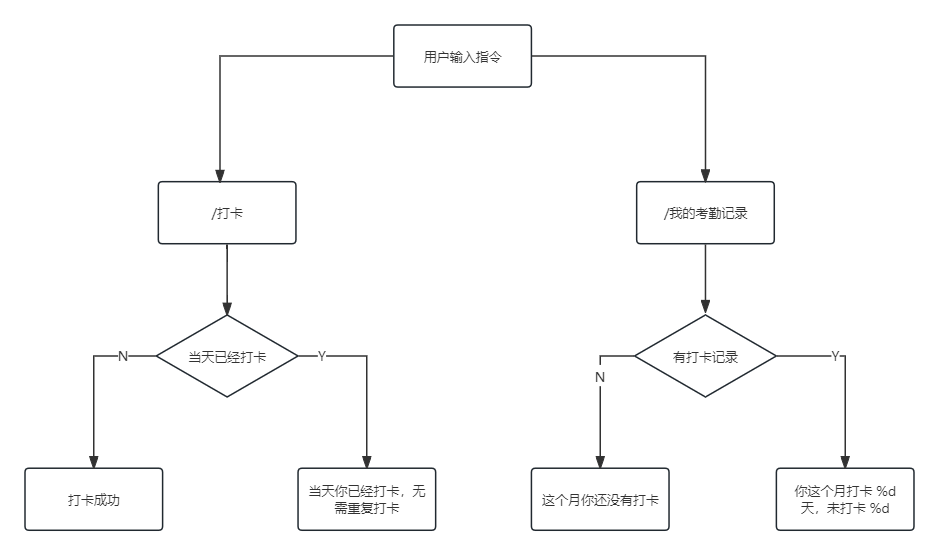

# FishBot 使用说明

### 功能介绍
<ol>
<li>猜数字：输入1-10之间的数字，猜中结束游戏，大于或者小于目标值会返回提示</li>
<li>考勤：用户可进行打卡操作，并且查询当月的打卡统计</li>
</ol>

### 猜数字功能详细流程

基本事件流：

用户输入 <strong>/猜数字</strong>，会从mysq中随机查询一个1-10的数字，并且缓存于redis中；

用户输入 <strong>/猜数字 x</strong>，当用户输入正确答案，会返回正确答案，并且清除缓存记录；

用户输入 <strong>/告诉我猜数字答案</strong>，会返回正确答案，并且清除缓存记录

未开始游戏，用户输入 <strong>/猜数字 x</strong>  或 <strong>/告诉我猜数字答案</strong>,返回：<strong>你还没开始游戏，输入无效</strong>

### 考勤功能详细流程

基本事件流：

用户输入 <strong>/打卡 </strong>，当天未打卡的，会落库，返回：<strong>打卡成功</strong>，当天已经打卡，返回：<strong>当天你已经打卡，无需重复打卡</strong>；

用户输入 <strong>/我的考勤记录 x</strong>，用户当月还没打卡过，返回：<strong>这个月你还没有打卡</strong>，用户当月有打卡记录，返回：<strong>你这个月打卡 %d 天，未打卡 %d</strong>

### 使用示例
