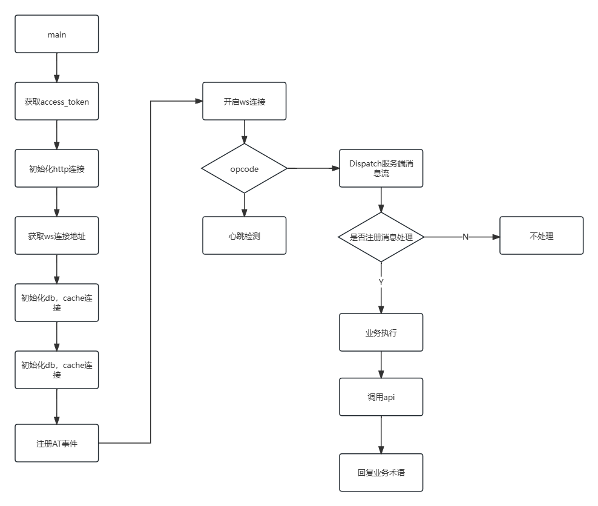

# FishBot 方案设计
[toc]

### 使用技术

Go（1.23.0）、Mysql（8.0.39）、Redis（5.0.7）、go-resty（v2）、GORM(v2)

### 服务端通信处理流程


### 存储设计
<p>random_numbers表设计</p>

字段     | 数据类型 | 是否索引    | 注释 |
-------- |------|---------| -----
id  | int  | 自增主键 | 
num  | int |        | 默认为0，随机数

<p>attendance表设计</p>

字段     | 数据类型      | 是否索引 | 注释 |
-------- |-----------|------| -----
id  | int       | 自增主键 |
user_id  | varchar(255) | 普通索引 | 不为空，用户id
name  | varchar(255) |      | 不为空，成员名称
attendance_date  | date      |      | 默认空，打卡日期
type  | tinyint   |      | 默认为0，0-未打卡，1-已打卡

### 运行
运行前，需要修改跟目录下的配置文件config.yaml
```
appid: xxx
token: xxx
mysqlConnect: root:123456@tcp(127.0.0.1:3306)/fishbot?charset=utf8mb4&parseTime=True&loc=Local
redisConnect: localhost:6379
```
<p>导入根目录的fishbot.sql文件到数据库</p>
<p>在开发平台：配置一下指令</p>
<ul>
<li>/猜数字</li>
<li>/告诉我猜数字答案</li>
<li>/打卡</li>
<li>/我的考勤记录</li>
</ul>
<p>最后运行main.go</p>

### 测试流程
根目录下的test文件夹

#### db接口测试
<ol>
<li>初始化db连接</li>
<li>调用dao层接口，测试CRUD是否正确</li>
</ol>

#### service核心业务测试
<ol>
<li>初始化db、cache连接，不涉及外部api测试</li>
<li>根据ws推送消息，构建模拟测试数据，并存放在json文件中</li>
<li>反序列化json数据，分析指令，验证业务流程</li>
</ol>

